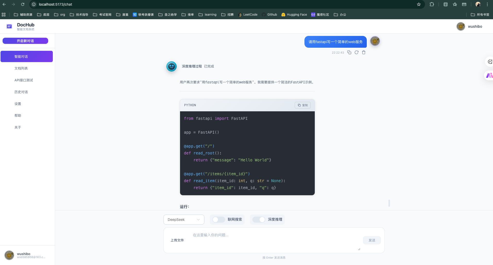

# 个人文档系统

一个基于现代前端技术栈构建的个人文档系统，集成了智能聊天、API测试、文档管理等多种功能，提供了现代化的用户界面和流畅的用户体验。

## 系统界面

### 首页截图



### 界面特点

- **响应式设计**：适配不同屏幕尺寸，提供良好的移动端体验
- **现代化UI**：采用Element Plus组件库，界面简洁美观
- **主题切换**：支持浅色主题、深色主题和跟随系统主题
- **流畅交互**：实时消息发送和接收，流畅的动画效果

## 核心功能

### 1. 智能聊天
- 支持与AI进行智能对话
- 聊天记录持久化存储
- 支持多种AI模型切换
- 支持文件上传
- 支持网络搜索功能

### 2. 文档管理
- 文档分类管理
- 文档搜索功能
- 文档预览和编辑
- 支持多种文档格式

### 3. API测试
- 支持从OpenAPI文档地址获取接口信息
- 动态生成API测试界面
- 支持多种HTTP方法
- 实时显示响应结果

### 4. 历史记录
- 查看和管理聊天历史
- 支持历史记录搜索和筛选
- 支持会话管理

## 技术栈

- **前端框架**：Vue 3（Composition API）
- **UI组件库**：Element Plus
- **HTTP客户端**：Axios
- **构建工具**：Vite
- **路由管理**：Vue Router 4
- **状态持久化**：localStorage

## 快速开始

### 安装依赖

```bash
npm install
```

### 启动开发服务器

```bash
npm run dev
```

访问 http://localhost:5173 查看应用。

### 构建生产版本

```bash
npm run build
```

构建产物将输出到 `dist` 目录。

## 许可证

MIT License
