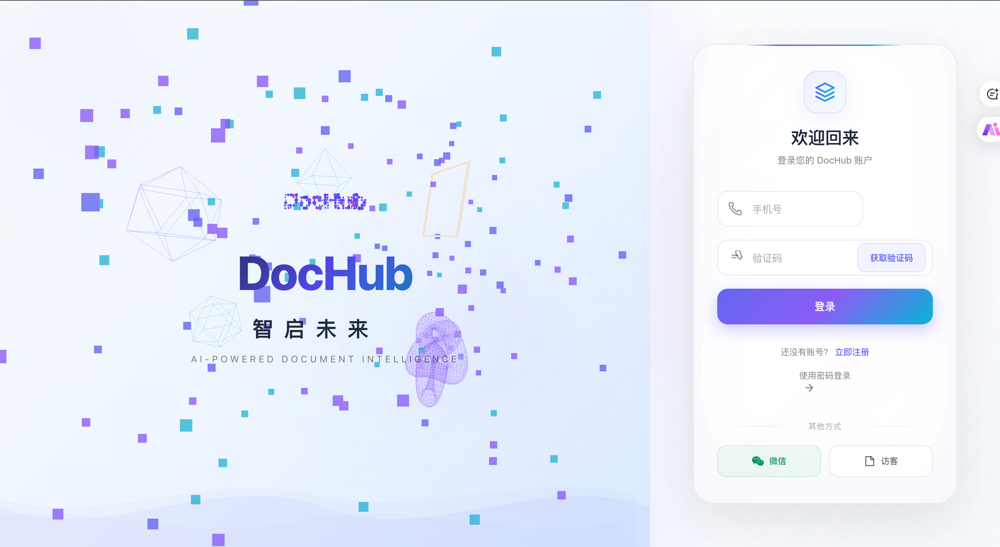
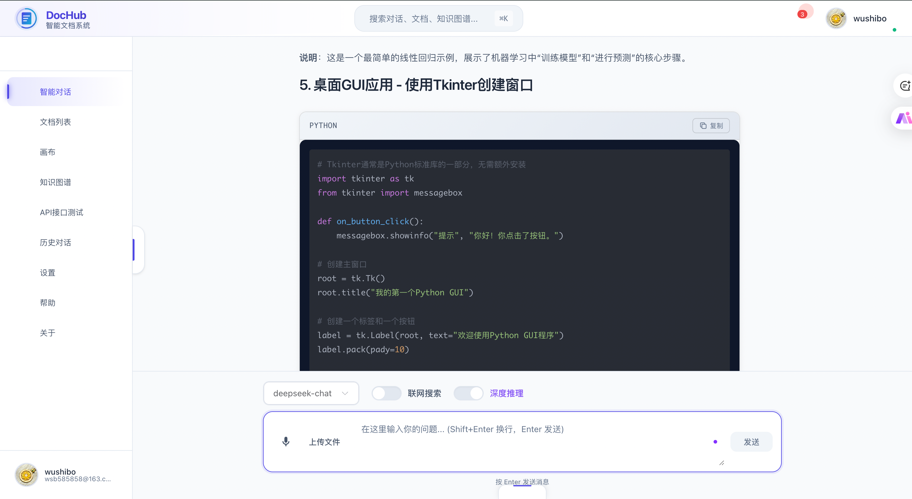

# 智启未来 (Personal Doc System)

> 一个基于现代前端技术栈构建的智能工作平台，集成AI对话、知识图谱、可视化编排、文档管理等功能

[](https://vuejs.org/)
[](https://vitejs.dev/)
[](https://element-plus.org/)
[](https://router.vuejs.org/)
[](https://axios-http.com/)
[](https://marked.js.org/)
[](https://threejs.org/)
[](LICENSE)

## 🖼️ 界面预览

### 登录页面


### 首页概览


## ✨ 功能亮点

### 🤖 智能对话
- **流式输出**：AI响应逐字渲染，体验流畅
- **Markdown渲染**：支持代码高亮、表格、列表等富文本
- **深度推理**：可折叠展示AI的思考过程
- **多模型切换**：支持 DeepSeek、GLM、Qwen、Doubao、Llama 等多种AI模型
- **联网搜索**：可选开启在线搜索功能，增强AI回答能力
- **文件上传**：支持上传文档作为对话上下文（支持 .doc, .docx, .pdf, .txt，最大500MB）
- **优化交互**：
  - 精美的开关控件，支持深色/浅色主题自适应
  - 实时状态指示，操作反馈清晰
  - 会话历史持久化存储

### 📁 文档管理
- 文档上传与处理状态追踪
- 文档列表预览与管理
- 支持多种文档格式

### 🔧 API测试
- OpenAPI文档导入
- 动态生成测试界面
- 支持多种HTTP方法
- 响应结果格式化展示

### 🕸️ 知识图谱
- **可视化图谱**：基于Canvas的交互式实体关系图
- **实体管理**：实体创建、编辑、删除，支持命名空间组织
- **关系探索**：多跳关系查询，路径发现与可视化
- **图谱推理**：基于知识图谱的智能推理与问答
- **统计面板**：图谱数据统计与分析
- **文档构建**：从知识图谱自动生成结构化文档

### 🎨 画布编排
- **可视化工作流**：拖拽式节点编排，直观清晰
- **多种节点类型**：开始、结束、条件、循环、智能体节点
- **执行监控**：实时查看工作流执行状态与日志
- **模板库**：预设工作流模板，快速启动
- **节点配置**：灵活配置节点参数与连接关系

### 🎨 登录体验
- **3D粒子特效**：Three.js构建的沉浸式背景动画
- **粒子Logo**：Canvas粒子汇聚成Logo的动态效果
- **打字机标语**：逐字展示"智启未来"主题标语
- **波浪动画**：底部SVG多层波浪装饰
- **科技感UI**：渐变装饰、发光按钮、玻璃态输入框

### 🎨 界面特性
- **主题切换**：浅色/深色/跟随系统，使用 CSS 变量实现
- **响应式设计**：适配桌面和移动设备
- **会话管理**：历史对话记录与搜索，支持本地持久化
- **性能优化**：
  - 组件代码优化，消除冗余逻辑
  - localStorage 操作高效管理
  - 样式复用，减少代码重复

## 🛠️ 技术栈

| 技术 | 说明 |
|------|------|
| Vue 3 | 渐进式前端框架，使用Composition API |
| Element Plus | Vue 3 组件库，提供丰富的UI组件 |
| Vue Router 4 | 路由管理，支持嵌套路由和导航守卫 |
| Axios | HTTP客户端，支持请求拦截和响应处理 |
| Vite | 下一代前端构建工具，极速开发体验 |
| Three.js | 3D图形库，用于登录页粒子特效 |
| marked | Markdown解析器，支持GFM（GitHub Flavored Markdown） |
| highlight.js | 代码语法高亮，支持180+种编程语言 |

## 🎬 最近更新

### v1.3.0 (2026-03)
- ✨ **知识图谱功能**：
  - 可视化实体关系图谱
  - 实体/关系管理面板
  - 路径探索与推理功能
  - 图谱统计与文档构建
- ✨ **画布编排功能**：
  - 可视化工作流编辑器
  - 多种节点类型支持
  - 工作流执行监控
  - 模板库与节点配置
- 🎨 **登录页面升级**：
  - Three.js 3D粒子背景特效
  - Canvas粒子汇聚Logo动画
  - 打字机效果标语展示
  - SVG波浪装饰动画
  - 科技感UI设计优化
- 🔧 **界面优化**：
  - 移除冗余的新建对话和历史记录按钮
  - 优化侧边栏交互体验

### v1.2.0 (2026-03)
- ✨ **语音消息支持**：
  - 支持语音输入，流式生成回复
  - 实时语音识别与响应
- 🐛 **深色模式优化**：
  - 修复登录下拉菜单背景渲染问题
- 💬 **聊天交互优化**：
  - 优化聊天输入组件和界面交互
  - 断点续传功能支持

### v1.1.0 (2026-03)
- ✨ **聊天输入组件优化**：
  - 重构开关控件样式，支持自适应主题
  - 优化 localStorage 配置管理，提升性能
  - 消除代码重复，减少150+行冗余CSS
  - 改进视觉反馈，开启状态更明显
- 🐛 **Bug修复**：
  - 修复 prop 默认值未生效问题
  - 修复 localStorage 双重写入问题
  - 移除未使用的导入和变量
- 🎨 **样式优化**：
  - 开关控件使用紫色主题色
  - 深色/浅色模式完美适配
  - Hover 效果优化，交互更流畅

## 📦 快速开始

```bash
# 克隆项目
git clone <repository-url>

# 进入项目目录
cd doc_system_fe

# 安装依赖
npm install

# 启动开发服务器
npm run dev
```

访问 http://localhost:5173

```bash
# 构建生产版本
npm run build

# 预览生产构建
npm run preview
```

## 📁 项目结构

```
doc_system_fe/
├── src/
│   ├── api/              # API接口封装
│   │   ├── auth.js               # 认证接口
│   │   ├── document.js           # 文档管理接口
│   │   ├── intelligentSearch.js  # 智能搜索接口
│   │   ├── agent.js              # 智能体接口
│   │   └── knowledgeGraph.js     # 知识图谱接口
│   ├── components/       # 公共组件
│   │   ├── ChatInput.vue         # 聊天输入组件
│   │   ├── Header.vue            # 顶部导航
│   │   ├── Sidebar.vue           # 侧边栏菜单
│   │   ├── MainContainer.vue     # 主容器
│   │   ├── knowledgeGraph/       # 知识图谱组件
│   │   │   ├── canvas/           # 图谱画布
│   │   │   ├── panels/           # 功能面板
│   │   │   └── sidebar/          # 侧边栏
│   │   └── workflow/             # 工作流组件
│   │       ├── canvas/           # 工作流画布
│   │       ├── nodes/            # 节点组件
│   │       ├── panels/           # 配置面板
│   │       └── templates/        # 模板库
│   ├── utils/            # 工具函数
│   │   ├── userStore.js          # 用户状态管理
│   │   ├── chatConfig.js         # 聊天配置
│   │   ├── knowledgeGraph/       # 知识图谱工具
│   │   └── workflow/             # 工作流工具
│   ├── stores/           # 状态管理
│   │   ├── knowledgeGraphStore.js
│   │   ├── workflowStore.js
│   │   └── knowledgeGraph/       # 知识图谱子模块
│   ├── styles/           # 全局样式
│   │   ├── animations.css        # 动画效果
│   │   ├── base.css              # 基础样式
│   │   ├── components.css        # 组件样式
│   │   ├── themes.css            # 主题样式
│   │   └── tokens.css            # CSS变量
│   ├── views/            # 页面组件
│   │   ├── ChatPage.vue          # 智能对话页面
│   │   ├── DocumentsPage.vue     # 文档管理页面
│   │   ├── ApiTestPage.vue       # API测试页面
│   │   ├── HistoryPage.vue       # 历史记录页面
│   │   ├── SettingsPage.vue      # 设置页面
│   │   ├── LoginPage.vue         # 登录页面
│   │   ├── KnowledgeGraphPage.vue # 知识图谱主页
│   │   ├── CanvasWorkflow.vue    # 画布编排页面
│   │   └── knowledgeGraph/       # 知识图谱子页面
│   ├── router/           # 路由配置
│   ├── App.vue           # 根组件
│   └── main.js           # 入口文件
├── public/               # 静态资源
│   ├── dengluye.png      # 登录页预览图
│   └── shouye.png        # 首页预览图
├── index.html            # HTML模板
├── vite.config.js        # Vite配置
└── package.json          # 项目配置
```

## 🔑 核心功能说明

### 流式输出实现

智能对话采用SSE（Server-Sent Events）实现流式输出：

1. **逐字渲染**：接收chunk时立即累加显示，提供流畅的打字效果
2. **内容解析**：自动分离推理过程（`<推理过程>`）和最终答案（`<最终答案>`）
3. **Markdown处理**：渲染完成时自动解析Markdown并高亮代码块
4. **状态管理**：支持思考中/已完成状态展示

### 主题系统

使用CSS变量实现主题切换，主要变量定义在 `App.vue`：

- `--primary-color` - 主题色
- `--bg-color` / `--surface-color` - 背景色
- `--text-primary` / `--text-secondary` - 文字颜色

### 路由配置

| 路径 | 组件 | 说明 |
|------|------|------|
| / | - | 重定向到聊天页面 |
| /chat | ChatPage | 智能对话 |
| /documents | DocumentsPage | 文档管理 |
| /knowledge-graph | KnowledgeGraphPage | 知识图谱 |
| /canvas | CanvasWorkflow | 画布编排 |
| /api-test | ApiTestPage | API测试 |
| /history | HistoryPage | 历史记录 |
| /settings | SettingsPage | 系统设置 |
| /help | HelpPage | 帮助中心 |
| /about | AboutPage | 关于系统 |

## 🚀 部署

```bash
# 构建
npm run build

# 将 dist 目录部署到静态服务器
# 例如 Nginx:
cp -r dist/* /usr/share/nginx/html/
```

## 📝 开发规范

- 使用 Vue 3 Composition API
- 组件命名采用 PascalCase
- 提交遵循 Conventional Commits 规范
- 避免使用 `v-html`，注意 XSS 防护

## 🌐 浏览器兼容性

- Chrome >= 90
- Firefox >= 88
- Safari >= 14
- Edge >= 90

## 📄 许可证

MIT License

---

如有问题或建议，欢迎提交 Issue 或 Pull Request。
